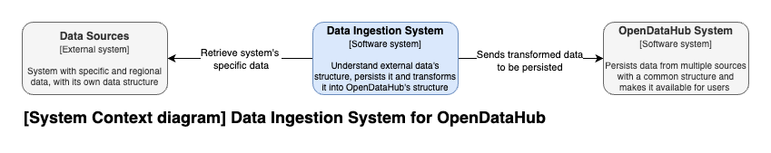
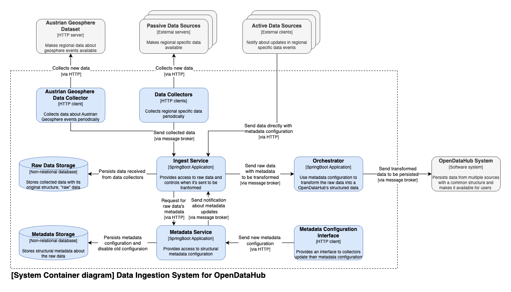

# Data Ingestion

This is a Monorepo that contain 4 services:

* [Austrian Geosphere Data Collector](https://github.com/gfmota/data-ingestion-monorepo/tree/master/applications/austrian-geosphere-data-collector)
* [Ingestion Service](https://github.com/gfmota/data-ingestion-monorepo/tree/master/applications/ingest-service)
* [Metadata Service](https://github.com/gfmota/data-ingestion-monorepo/tree/master/applications/metadata-service)
* [Orchestrator](https://github.com/gfmota/data-ingestion-monorepo/tree/master/applications/orchestrator)

They are all Java Spring Boot applications that were built as a submodule of this repository, 
but can be compiled and deployed independently.

## Context

This system is used to represent a data ingestion proposal for the [OpenDataHub](https://opendatahub.com/)'s use case.

The main goal is to collect data from different source, transform them into a standardize pattern to be persisted
by the OpenDataHub, and furthermore consumed by the end user.

## Architecture

The architecture proposed has focus on extensibility. We want to be able to extend the system for new data sources
with less work as possible.

This architecture solves that by the use of structured metadata, a configuration file that can be sent/collected 
with the data or configured for a specific data source and lifetime. And is used to identify valuable fields in the 
original data and map them to the expected pattern for OpenDataHub.

Another benefit achieved by this architecture is the trackbility of the original data. As it is persisted by the
Ingestion Service, on Raw Data Storage, it can be used as a debug tool and even reprocessed if needed. Decreasing
the risk of data loss due to a miss configuration, process error or infrastructure instability.

## Run

You can use the Makefile to run the services. Use `make build` to prepare the modules and `make run` to run them
and start the docker containers necessary. Use the log files on the logs folder to monitor the services.

You can also use `make configure-metadata` to send a http request for the Metadata Service to 
configure a metadata. The configuration used can be changed on the `./metadata-configuration-request-body.json`

Use `make ingest-data` to send a http request for the Ingest Service to send data to be ingested. 
The data sent can be changed on the `./raw-data-to-be-ingested.json`

There is also a Postman collection on the `./Data Ingestion System.postman_collection.json`
that can be used to access HTTP clients available by the system.